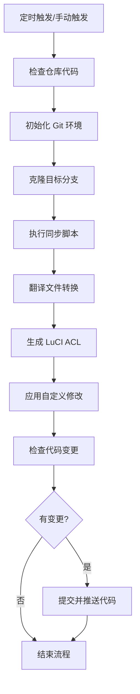

# 🚀 AutoSync - OpenWRT 插件自动化同步流水线

> 基于 GitHub Actions 的全自动 OpenWRT 插件同步与维护解决方案

<div align="center">
  
  
  
  
</div>

---

## 📖 项目简介

AutoSync 是一个基于 GitHub Actions 的 OpenWRT 插件自动化同步项目，专为 OpenWRT 开发者和爱好者打造。通过 GitHub Actions 的强大自动化能力，无需任何服务器资源，即可实现上游插件仓库的定期同步、代码自动优化、翻译转换、ACL 生成等一系列自动化工作流。

### ✨ 核心价值

- **💯 零成本运维**：完全基于 GitHub Actions 免费额度运行，无需额外服务器
- **⚡ 极致自动化**：从同步到优化一键完成，无需人工干预
- **📦 纯净无污染**：只同步真正需要的插件代码，去除冗余内容
- **🔧 高度可定制**：通过 Shell 脚本灵活扩展同步逻辑
- **🌍 多版本支持**：同时维护多个 OpenWRT 版本分支

---

## 🎯 核心特性

### 🤖 自动化工作流
- **定时同步**：每 4 小时自动检测上游仓库更新
- **手动触发**：支持通过 GitHub UI 手动触发同步
- **事件驱动**：支持 Repository Dispatch 事件触发
- **多分支管理**：同时维护多个 OpenWRT 版本分支

### 🛠️ 自动化优化
- **翻译转换**：自动将插件翻译文件转换为 OpenWRT 兼容格式
- **ACL 生成**：自动为 LuCI 插件创建访问控制列表
- **代码修改**：自动应用自定义代码补丁和优化
- **冗余清理**：自动清理 deprecated 和无用文件

### 📊 智能提交
- **随机表情**：每次自动提交使用随机 emoji 表情，让提交记录更生动
- **时间戳**：提交信息包含同步时间，便于追溯
- **空提交检测**：无更新时自动跳过提交，避免空提交

---

## 🚀 快速开始

### 🔧 配置步骤

#### 1. Fork 本仓库
点击页面右上角的 **Fork** 按钮，将本仓库复制到你的 GitHub 账号下

#### 2. 创建访问令牌
1. 进入 GitHub **Settings** → **Developer settings** → **Personal access tokens**
2. 生成一个新的 token，勾选 `repo` 权限
3. 复制生成的 token

#### 3. 配置仓库 Secrets
1. 进入你的 Fork 仓库 → **Settings** → **Secrets and variables** → **Actions**
2. 点击 **New repository secret**
3. 添加名为 `ACCESS_TOKEN` 的 secret，值为你刚才生成的访问令牌

#### 4. 自定义同步逻辑
1. 编辑 `.github/diy/openwrt_packages.sh` 文件，添加你需要同步的插件仓库
2. 编辑 `.github/diy/Modify.sh` 文件，添加自定义代码修改逻辑
3. 调整 `.github/workflows/openwrt_packages.yml` 中的定时同步间隔

#### 5. 启用 GitHub Actions
1. 进入你的 Fork 仓库 → **Actions** 页面
2. 点击 **I understand my workflows, go ahead and enable them**
3. 选择 `openwrt_packages` workflow，点击 **Run workflow** 手动触发首次同步

---

## 📋 工作流说明

### 🗂️ 项目结构

```
AutoSync/
├── .github/
│   ├── workflows/
│   │   ├── openwrt_packages.yml    # 主工作流配置
│   │   └── openwrt_helloworld.yml  # 示例工作流
│   └── diy/
│       ├── openwrt_packages.sh     # 插件同步逻辑
│       ├── openwrt_helloworld.sh   # 示例同步脚本
│       ├── convert_translation.sh  # 翻译转换脚本
│       ├── create_acl_for_luci.sh  # ACL 生成脚本
│       └── Modify.sh               # 代码修改脚本
├── LICENSE                         # GPLv3 许可证
└── README.md                       # 项目说明文档
```

### 🔄 同步流程



### ⏰ 定时策略

默认配置为每 4 小时同步一次：
```yaml
on:
  schedule:
    - cron: 0 */4 * * *  # 每4小时运行一次
```

你可以根据需要修改为：
- `0 0 * * *`：每天凌晨同步
- `0 0 * * 0`：每周日凌晨同步
- `*/30 * * * *`：每30分钟同步

---

## 🎨 自定义配置

### 📝 同步脚本示例

编辑 `.github/diy/openwrt_packages.sh`：

```bash
#!/bin/bash

# 同步 openwrt/packages 仓库
git clone https://github.com/openwrt/packages.git temp_packages
cp -rf temp_packages/net/* net/
cp -rf temp_packages/utils/* utils/
rm -rf temp_packages

# 同步自定义插件仓库
git clone https://github.com/xxx/xxx-packages.git temp_custom
cp -rf temp_custom/* ./
rm -rf temp_custom
```

### 🔧 自定义修改

编辑 `.github/diy/Modify.sh`：

```bash
#!/bin/bash

# 修改插件版本号
sed -i 's/1.0.0/2.0.0/g' package/xxx/Makefile

# 替换镜像源
sed -i 's/downloads.openwrt.org/mirrors.tuna.tsinghua.edu.cn\/openwrt/g' package/feeds/packages/*/Makefile

# 添加自定义补丁
patch -p1 < $GITHUB_WORKSPACE/patches/xxx.patch
```

---

## 🤝 贡献指南

我们非常欢迎社区贡献！无论是代码、文档、bug 报告还是功能建议，都可以通过以下方式参与：

### 📋 贡献步骤

1. Fork 本仓库到你的 GitHub 账号
2. 创建特性分支：
   ```bash
   git checkout -b feature/AmazingFeature
   ```
3. 提交你的更改：
   ```bash
   git commit -m 'Add some AmazingFeature'
   ```
4. 推送到分支：
   ```bash
   git push origin feature/AmazingFeature
   ```
5. 打开 Pull Request，描述你的变更内容

### 📌 贡献规范

- 遵循 Shell 脚本编写规范，使用 `shellcheck` 检查代码
- 保持脚本简洁明了，添加必要的注释
- 确保所有工作流能够正常通过
- 更新相关文档说明

---

## 📄 许可证

本项目采用 **GNU General Public License v3.0** 开源许可证，详见 [LICENSE](LICENSE) 文件。

---

## 🙏 致谢

感谢以下开源项目和社区的支持：

- [OpenWRT](https://openwrt.org/) - 优秀的开源路由器操作系统
- [GitHub Actions](https://github.com/features/actions) - 强大的自动化 CI/CD 平台
- [Lean's OpenWRT](https://github.com/coolsnowwolf/lede) - 提供了丰富的插件资源
- [P3TERX](https://github.com/P3TERX/Actions-OpenWrt) - 启发了本项目的自动化思路

---

## 📞 联系方式

<div align="center">
  <a href="https://github.com/Xiaokailnol/AutoSync/issues" style="margin: 0 10px;">
    
  </a>
  <a href="mailto:2519840456@qq.com" style="margin: 0 10px;">
    
  </a>
</div>

---

<div align="center">
  <h3>⭐ 如果这个项目对你有帮助，请给个 Star 支持一下！</h3>
  <p>你的支持是我们持续开发的动力！</p>
</div>
